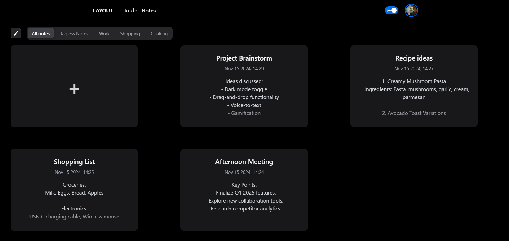

# Planner App

This is a React.js application built with NextUI for the UI components and Firebase for Google Authentication and Firestore as the database. The app allows users to take detailed notes, organize them with custom tags, and manage to-do tasks alongside their notes.

## Features

- **Notes**: Create and manage detailed notes efficiently.
- **Custom Tags**: Organize notes by adding custom tags for better categorization and filtering.
- **Task Management**: Add, edit, and delete tasks.
- **Firebase Integration**: Secure Google Authentication and real-time database via Firestore.
- **Responsive UI**: Powered by NextUI for a clean and modern interface.

## Screenshots

Here are some screenshots of the application:

1. **Detailed Tasks View**:
   

2. **Edit Notes**:
   

3. **Edit Task**:
   

4. **Notes View**:
   

5. **Tags**:
   

6. **Tasks View**:
   

## Installation

1. Clone the repository:

   ```bash
   git clone https://github.com/aayush125/layout.git
   cd layout
   ```

2. Install dependencies:

   ```bash
   npm install
   ```

3. Set up Firebase:

   - Create a Firebase project in the [Firebase Console](https://console.firebase.google.com/).
   - Enable Google Authentication in the "Authentication" section.
   - Set up Firestore as the database.
   - Create a `.env` (or `.env.local`) file in the root directory and add your Firebase configuration.

4. Start the development server:

   ```bash
   npm run dev
   ```

5. Open the app in your browser at [http://localhost:5173](http://localhost:5173).

## Tools Used

- **NextUI**: UI component library for clean and modern design.
- **Firebase**:
  - Google Authentication: Secure user login.
  - Firestore: Real-time database for storing notes, tasks, and tags.
